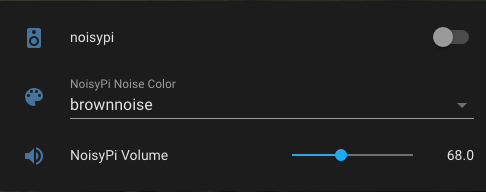

# noisyPi
Raspberry Pi noise generator integration with Home Assistant using MQTT.


[](https://github.com/ras434/noisyPi/stargazers)

---
# Requirements
+ Raspberry Pi
  + Speaker (connected to Raspberry Pi)
  + Python3 >= v3.7.3 (https://www.python.org/)
  + SoX - Sound eXchange (http://sox.sourceforge.net/)
  + paho-mqtt >= v1.5.1 (https://pypi.org/project/paho-mqtt/)
  + start **~/mqtt/noisypi.py** on boot via _/etc/rc.local_
+ Home Assistant (https://www.home-assistant.io/)
  + MQTT Broker (Mosquitto)
  + MQTT account (_to authenticate with NoisyPi_)
  + NoisyPi entities in _configuration.yaml_ file
    + switch.noisypi - _turn on/off_
    + input_value.noisypi - _set volume_
    + input_select.noisypi - _select noise color [whitenoise, pinknoise, brownnoise]_
  + Automations
    + volume publish & subscribe MQTT
    + noise color publish & subscribe MQTT

---
# Installation

## Steps


1. [Install Python3](https://github.com/ras434/noisyPi/tree/master#1--install-python3)
2. [Install SoX - Sound eXchange](https://github.com/ras434/noisyPi/tree/master#2-install-sox---sound-exchange)
3. [Install paho-mqtt](https://github.com/ras434/noisyPi/tree/master#3-install-paho-mqtt)
4. [Edit /etc/rc.local](https://github.com/ras434/noisyPi/tree/master#4-edit-etcrclocal)
5. [Clone noisyPi.py](https://github.com/ras434/noisyPi/tree/master#5-clone-noisypipy)
6. [Setup Home Assistant](https://github.com/ras434/noisyPi/tree/master#6-setup-home-assistant)
7. [Add noisyPi card to Home Assistant](https://github.com/ras434/noisyPi/tree/master#7-add-noisypi-card-to-home-assistant)
8. [Reboot Your Raspberry Pi](https://github.com/ras434/noisyPi/tree/master#8-reboot-your-raspberry-pi)

## 1.  Install Python3
From the Raspberry Pi:
```sh
  sudo apt update
  sudo apt install python3
```

## 2. Install SoX - Sound eXchange
From the Raspberry Pi:

```sh
  apt-get install sox
```

## 3. Install paho-mqtt
From the Raspberry Pi:

```sh
  pip install paho-mqtt
```

## 4. Edit /etc/rc.local
From the Raspberry Pi:

Using nano or vi edit **/etc/rc.local**.

**nano example:**

```sh
  sudo nano /etc/rc.local
```

> Paste the following lines to the end of the file.  
> **CTRL+X** to exit, **y** to save, and **ENTER** to accept file.

```sh
  # Run noisyPi setup
  amixer sset 'Headphone' 95%
  python3 /home/pi/noisyPi/noisyPi.py
  exit 0
```

## 5. Clone noisyPi.py
From the Raspberry Pi:

```sh
  mkdir ~/noisyPi
  cd ~/noisyPi
  wget https://raw.githubusercontent.com/ras434/noisyPi/main/noisyPi.py
```

## 6. Setup Home Assistant
From Home Assistant **configuration.yaml** file, add the following entries:

```yaml
  input_number:
    noisypi_volume:
      name: NoisyPi volume
      initital: 80
      min: 50
      max: 95
      step: 1
      icon: mdi:volume-high

  input_select:
    noisypi_noise_color:
      name: NoisyPi Noise Color
      options:
        - whitenoise
        - pinknoise
        - brownnoise
      initial: brownnoise
      icon: mdi:palette
  
  switch:
    - platform: mqtt
      name: "noisyPi"
      icon: mdi:speaker
      state_topic: "stat/noisypi/NOISE"
      command_topic: "cmnd/noisypi/NOISE"
      availability_topic: "tele/noisypi/LWT"
      payload_on: "on"
      payload_off: "off"
      state_on: "on"
      state_off: "off"
      qos: q
      retain: false
```
From Configuration > Automations, add the following 4 new automations:

<br>

NoisyPi Color (pub):
```yaml
alias: NoisyPi Color (pub)
description: NoisyPi Color Selection Changed
trigger:
  - platform: state
    entity_id: input_select.noisypi_noise_color
condition: []
action:
  - service: mqtt.publish
    data:
      topic: cmnd/noisypi/COLOR
      retain: true
      qos: '1'
      payload: '{{ states(''input_select.noisypi_noise_color'') }}'
mode: single
```

<br>

NoisyPi Color (sub):
```yaml
alias: NoisyPi Color (sub)
description: Set NoisyPi Color Value
trigger:
  - platform: mqtt
    topic: stat/noisypi/COLOR
condition: []
action:
  - service: input_select.set_value
    target:
      entity_id: input_select.noisypi_color
    data:
      value: '{{ trigger.payload }}'
mode: single
```

<br>

NoisyPi Volume (pub):
```yaml
alias: NoisyPi Volume (pub)
description: NoisyPi Volume Slider Moved
trigger:
  - platform: state
    entity_id: input_number.noisypi_volume
condition: []
action:
  - service: mqtt.publish
    data:
      topic: cmnd/noisypi/VOLUME
      retain: true
      qos: '1'
      payload: '{{ states(''input_number.noisypi_volume'') | int }}'
mode: single
```

<br>

NoisyPi Volume (sub):
```yaml
alias: NoisyPi Volume (sub)
description: Set NoisyPi Volume Slider
trigger:
  - platform: mqtt
    topic: stat/noisypi/VOLUME
condition: []
action:
  - service: input_number.set_value
    target:
      entity_id: input_number.noisypi_volume
    data:
      value: '{{ trigger.payload }}'
mode: single
```

## 7. Add noisyPi Card to Home Assistant
From Home Assistant:
In your Lovelace UI, edit your preferred dashboard and add the noisyPi elements:



## 8. Reboot Your Raspberry Pi:
From Raspberry Pi:

```sh
sudo reboot
```

Once your Pi completes the reboot it should automatically start **noisypi.py**.
